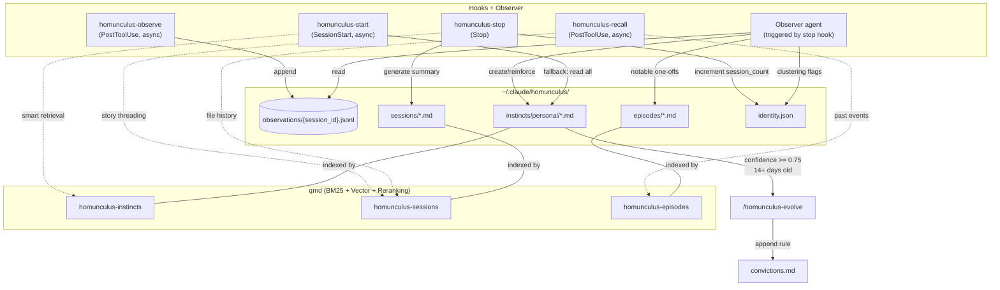
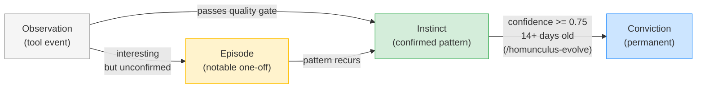

# Homunculus

An instinct-based learning system that observes your Claude
Code sessions and develops reusable behavioural patterns.
Backed by [qmd](https://github.com/tobi/qmd) for semantic
search over learned knowledge.

## Getting Started

```bash
/homunculus-init
```

This creates the directory structure at
`~/.claude/homunculus/` and verifies hooks are configured.

## Overview



**Only manual step:** `/homunculus-evolve` to promote mature
instincts to permanent convictions. Everything else is
automatic.

### Data Lifecycle



## What's an Instinct?

An instinct is a small, atomic learned behaviour:

```markdown
---
trigger: "when writing new functions"
action: "prefer pure functions with explicit inputs/outputs"
confidence: 0.7
domain: code-style
created: 2026-02-01T14:30:00Z
last_seen: 2026-02-07T10:15:00Z
---

# Prefer Functional Style

## Evidence

- Observed 12 instances of functional pattern preference
- User consistently avoided class-based design
```

**Properties:**

- **Atomic**: One trigger, one action
- **Confidence-weighted**: 0.3 (tentative) to 0.9
  (near-certain), with time-based decay
- **Domain-tagged**: code-style, testing, git, debugging, etc.
- **Evidence-backed**: Documents why the instinct exists
- **Temporally-aware**: `last_seen` tracks when the pattern
  was last reinforced

## What's a Session?

A session summary is a markdown file generated by the stop
hook when a Claude Code session ends. Sessions form a
chronological record of what happened, linked together via
story threading.

```markdown
---
date: 2026-02-08T18:52:44Z
project: my-project
directory: /home/user/projects/my-project
session_id: a1b2c3d
tools_used: [Read, Bash, Grep, Edit, Write]
continues_from: 2026-02-07T131448Z.md
---

# Session: my-project

## Files touched

- src/config.ts
- tests/config.test.ts
- README.md

## Summary

Refactored configuration loading with test coverage.
Reinforced code-style-edit-sequencing and testing-shellcheck-primary-validation.
```

**Properties:**

- **Automatic**: Generated at session close, no manual step
- **Story-threaded**: `continues_from` links to the previous
  session in the same project, building a narrative chain
- **Enriched**: The observer appends a brief summary after
  processing observations
- **Searchable**: Indexed in the `homunculus-sessions` qmd
  collection for recall

## What's an Episode?

An episode captures a notable one-off event that doesn't
(yet) meet the 3-occurrence threshold for an instinct.
Episodes are a staging area: interesting enough to remember,
but not yet a confirmed pattern.

```markdown
---
date: 2026-02-07T11:44:00Z
type: episode
project: my-project
tags: [debugging, auth, api]
---

# Auth Token Refresh: Race Condition Discovery

Token refresh triggered mid-request caused 401 cascade across
3 endpoints.
Fixed by queuing requests during refresh instead of failing fast.
```

**Properties:**

- **Below threshold**: Fewer than 3 occurrences of the
  pattern
- **Promotable**: If the pattern recurs in later sessions,
  the observer promotes the episode to an instinct (starting
  at 0.5 confidence) and deletes the episode file
- **Searchable**: Indexed in the `homunculus-episodes` qmd
  collection for recall
- **Selective**: Only genuinely interesting events become
  episodes, not routine tool usage

## Hooks

Four hooks run automatically during Claude Code sessions:

### homunculus-observe (PostToolUse, async)

Runs asynchronously after every tool call so it never blocks
Claude. Captures structured observations for every tool
invocation. Extracts context based on tool type:

| Tool        | Context captured                               |
| ----------- | ---------------------------------------------- |
| Write, Edit | File extension, filename, description (intent) |
| Bash        | Base command, description (intent)             |
| Grep, Glob  | Search pattern                                 |
| Read        | Filename (for sequence analysis)               |

Noisy commands (cat, ls, git status, etc.) are filtered out.
Each observation includes a `session_id` (read directly from
the hook payload) so the observer can group observations by
session. The hook skips logging when the
`HOMUNCULUS_OBSERVER` environment variable is set, preventing
the observer agent from observing itself.

### homunculus-start (SessionStart, async)

Runs asynchronously so it never blocks session start. Injects a
compact index of relevant instincts (trigger + confidence only)
into the session context. The agent reads the full instinct file
on demand when it encounters a matching trigger. Skips instincts
already promoted to convictions.

1. Builds a search query from project name and detected
   language/framework (Cargo.toml, package.json,
   pyproject.toml, go.mod, etc.)
2. If the total instinct count exceeds `QMD_THRESHOLD` (30),
   queries `qmd query` (hybrid: BM25 + vector + reranking)
   against the `homunculus-instincts` collection for the
   top 15 matches. Below the threshold, shows all instincts
   (the compact index format makes this essentially free).
3. Falls back to all instincts if qmd is unavailable or
   returns nothing
4. Outputs trigger + confidence per instinct (not the full
   action text), with a general path hint for on-demand reading

Also reports the count of pending observations.

### homunculus-stop (Stop)

Runs at session close. Never blocks (errexit intentionally
omitted, exits 0 always).

1. Increments `session_count` and updates `last_session` in
   `identity.json`
2. Generates a session summary markdown file in `sessions/`
   with:
   - YAML frontmatter: date, project, directory,
     session_id, tools_used
   - Tool frequency stats extracted from the session's
     `observations/{session_id}.jsonl`
   - List of files touched during the session
3. Story threading: queries qmd for the most recent previous
   session from the same project and links via
   `continues_from` in frontmatter
4. Triggers the observer agent in the background to process
   accumulated observations (sets `HOMUNCULUS_OBSERVER=1` to
   prevent the observer from observing itself)

### homunculus-recall (PostToolUse, async)

Mid-session recall hook. After an Edit, Write, or MultiEdit
completes, queries qmd for past sessions and episodes
involving the same file. Runs asynchronously so it adds zero
latency. Context arrives as a `[RECALL]` system reminder,
informing subsequent decisions.

Two qmd searches (sessions and episodes) run in parallel to
minimise wall-clock time. Requires qmd to be installed;
silently skips if unavailable.

## Observer Agent

The observer is triggered by the stop hook at session end. It
runs in the background so it doesn't block session close. A
lock file prevents concurrent runs if sessions close in rapid
succession. It reads accumulated observations, identifies
patterns, and produces three outputs:

### Instincts (3+ occurrences required)

Patterns observed three or more times become instincts in
`instincts/personal/`. The observer:

1. Reads per-session files from `observations/*.jsonl` and
   ALL existing instincts
2. Identifies patterns that pass the quality gate (error
   recovery, project-specific knowledge, user corrections,
   hard-won debugging, domain-specific tool sequences)
3. Runs deduplication check against existing instincts before
   creating new ones (reinforces existing if overlap found)
4. Checks for contradictions (reduces confidence by 0.10 if
   3+ observations contradict an existing instinct)
5. Creates new instincts or reinforces existing ones
   (updating `last_seen`)
6. Applies confidence decay to stale instincts
7. Detects domain clustering and flags promotion
   opportunities in `identity.json`
8. Archives processed observations

### Episodes (notable one-offs)

Events below the 3-occurrence threshold but genuinely
interesting are saved as episode files in `episodes/`. If the
same pattern recurs in later sessions (reaching 3+ total
occurrences), the observer promotes the episode to an instinct
and deletes the episode file. See
[What's an Episode?](#whats-an-episode) for the format and
lifecycle.

### Confidence Decay

Instincts that aren't reinforced by new observations gradually
lose confidence:

```text
new_confidence = max(0.20, confidence - 0.05 * floor((now - last_seen) / 7 days))
```

- Decay is 0.05 per 7-day period since `last_seen`
- Minimum confidence is 0.20 (instincts are never deleted,
  just deprioritised)
- When an observation reinforces an instinct, `last_seen`
  resets to now and confidence can increase

The agent prompt lives at
`claude/agents/homunculus-observer.md`. Sends a macOS
notification on failure only. Logs to
`~/.claude/homunculus/observer.log`.

## Promotion

Mature instincts graduate to permanent rules in
`convictions.md` via `/homunculus-evolve`. Convictions are
injected at session start (before instincts) and do not decay.
This replaces the old evolution system which clustered
instincts into skill files that were just reformatted noise.

**Promotion criteria** (all must be met):

| Criterion            | Threshold               | Rationale                   |
| -------------------- | ----------------------- | --------------------------- |
| Confidence           | >= 0.75                 | Pattern is well-established |
| Age                  | >= 14 days              | Survived 2+ decay cycles    |
| Last seen            | Within 7 days           | Still actively relevant     |
| Not already promoted | `promoted: true` absent | Avoid duplicates            |

**What promotion produces:**

A concise rule appended to `~/.claude/homunculus/convictions.md`:

```markdown
# Convictions

Instincts promoted to permanent rules after sustained high confidence.
These are injected at session start and do not decay.

- **launchctl operations**: Use `sleep 5` between `launchctl unload` and `launchctl load`.
  Validate plist with `plutil -lint` before loading.
```

**After promotion:**

- The instinct gets `promoted: true` and
  `promoted_to: <path>` in its frontmatter
- The start hook skips promoted instincts (they are already
  in convictions.md)
- The observer still tracks reinforcement (updates
  `last_seen`)
- If a promoted instinct decays below 0.40,
  `/homunculus-evolve` warns the conviction may be stale

Preview with `/homunculus-evolve`, promote with
`/homunculus-evolve --promote`.

## qmd Integration

The homunculus produces markdown files.
[qmd](https://github.com/tobi/qmd) indexes markdown files.
Three collections bridge them:

| Collection             | Contents                     | Used by                                  |
| ---------------------- | ---------------------------- | ---------------------------------------- |
| `homunculus-instincts` | Learned behavioural patterns | Start hook (smart retrieval)             |
| `homunculus-sessions`  | Session summaries            | Stop hook (story threading), Recall hook |
| `homunculus-episodes`  | Notable one-off events       | Recall hook                              |

qmd provides BM25 full-text search, vector similarity search,
and LLM reranking, all over a local SQLite database. This
gives the homunculus semantic search capabilities without a
graph database or external services.

## File Structure

```text
~/.claude/homunculus/
├── identity.json               # Session count, last_session, promotion timestamps
├── convictions.md              # Promoted instincts (permanent rules, no decay)
├── observations/               # Pending per-session observation files
│   └── {session_id}.jsonl      # One file per session (avoids cross-session races)
├── observations.archive/       # Processed observation files
├── instincts/
│   ├── personal/               # Auto-learned instincts (*.md)
├── sessions/                   # Session summaries (*.md)
├── episodes/                   # Notable one-off events (*.md)
├── exports/                    # Exported instinct tarballs
├── observer.lock               # Lock file preventing concurrent observer runs
├── observer.log                # Observer run logs
└── last-processing.log         # Last processing summary
```

## Slash Commands

| Command                       | Description                                     |
| ----------------------------- | ----------------------------------------------- |
| `/homunculus-init`            | Initialise directory structure and verify setup |
| `/homunculus-instinct-status` | Show learned instincts with confidence levels   |
| `/homunculus-evolve`          | Promote mature instincts to convictions         |
| `/homunculus-feedback`        | Correct instinct confidence (wrong/weak/strong) |

## Confidence Scoring

| Score   | Meaning   | Behaviour                            |
| ------- | --------- | ------------------------------------ |
| 0.3-0.5 | Tentative | Apply if it feels right              |
| 0.5-0.7 | Moderate  | Apply unless there's a reason not to |
| 0.7-0.9 | Strong    | Apply consistently                   |

**How confidence changes:**

- New instinct: starts at 0.3-0.5 based on evidence
  strength
- Pattern observed again: increases, `last_seen` updated
- Stale (not seen in 7+ days): decays by 0.05 per week,
  minimum 0.20
- `/homunculus-feedback wrong`: drops to 0.20 (near-zero weight)
- `/homunculus-feedback weak`: decreases by 0.15
- `/homunculus-feedback strong`: increases by 0.10

## Instinct Domains

| Domain        | Examples                                  |
| ------------- | ----------------------------------------- |
| code-style    | Functional patterns, naming conventions   |
| testing       | Test-before-commit, coverage requirements |
| debugging     | Error-fix sequences, logging preferences  |
| git           | Commit message format, branch naming      |
| tooling       | Tool sequences, preferred tools           |
| architecture  | Design patterns, file organisation        |
| performance   | Optimisation patterns, caching strategies |
| security      | Input validation, secret handling         |
| documentation | Comment style, README format              |
| general       | Catch-all for uncategorised patterns      |

## Example Workflow

```bash
# 1. Work normally with Claude Code for a few sessions
#    Hooks capture observations automatically

# 2. Check what's been learned
/homunculus-instinct-status

# 3. Promote mature instincts to permanent convictions
/homunculus-evolve              # Preview candidates
/homunculus-evolve --promote    # Promote to convictions.md
```

## Troubleshooting

**No instincts being created:**

- Check observations exist:
  `ls ~/.claude/homunculus/observations/*.jsonl`
- Need 3+ occurrences of a pattern
- Observer triggers at session end via the stop hook

**Session count not incrementing:**

- Check `~/.claude/homunculus/identity.json` exists
- Verify `jq` is installed
- Stop hook runs on session end (not on crashes)

**Smart retrieval not working:**

- Check qmd is installed: `command -v qmd`
- Verify the instincts collection exists:
  `qmd collection list`
- Rebuild the index: `qmd update && qmd embed`

**Check observer output:**

```bash
cat ~/.claude/homunculus/observer.log
cat ~/.claude/homunculus/last-processing.log
```

## Claude Code Auto Memory

Claude Code's built-in auto memory (`MEMORY.md` files) is disabled
via `CLAUDE_CODE_DISABLE_AUTO_MEMORY=1` in `claude/settings.json`.
The homunculus system replaces it with richer semantics: confidence
weighting, temporal decay, deduplication, and structured promotion
from observations through instincts to convictions.

## Privacy

- Observations stay **local** on your machine
- Only **instincts** (patterns) can be exported for sharing
- No actual code or conversation content is shared
- qmd indexes are local SQLite, no network calls

## Credits

Inspired by
[Homunculus](https://github.com/humanplane/homunculus)
by humanplane.
