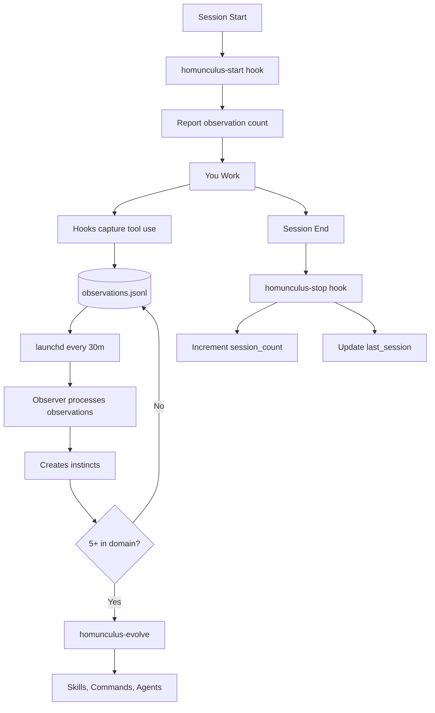

# Homunculus

An instinct-based learning system that observes your Claude Code sessions and develops reusable behavioural patterns.

## Getting Started

```bash
/homunculus-init
```

This creates the directory structure at `~/.claude/homunculus/` and verifies hooks are configured.

## Overview



**Only manual step:** `/homunculus-evolve` when 5+ instincts cluster. Everything else is automatic.

## What's an Instinct?

An instinct is a small, atomic learned behaviour:

```markdown
---
trigger: "when writing new functions"
action: "prefer pure functions with explicit inputs/outputs"
confidence: 0.7
domain: code-style
created: 2026-02-01T14:30:00Z
---

# Prefer Functional Style

## Evidence

- Observed 12 instances of functional pattern preference
- User consistently avoided class-based design
```

**Properties:**

- **Atomic**: One trigger, one action
- **Confidence-weighted**: 0.3 (tentative) to 0.9 (near-certain)
- **Domain-tagged**: code-style, testing, git, debugging, etc.
- **Evidence-backed**: Documents why the instinct exists

## Architecture

### Reliability

| Component                      | Reliability |
| ------------------------------ | ----------- |
| Observation capture (hooks)    | **100%**    |
| Session tracking (stop hook)   | **100%**    |
| Observer processing (launchd)  | **100%**    |
| Instinct creation              | **100%**    |

The critical path is fully deterministic via hooks. Skills enhance the experience but aren't required.

### File Structure

```
~/.claude/homunculus/
├── identity.json               # session_count, last_session, evolution flags
├── observations.jsonl          # Pending observations (processed by observer)
├── observations.archive/       # Processed observations
├── instincts/
│   ├── personal/               # Auto-learned instincts (*.md)
│   └── inherited/              # Imported from others
├── exports/                    # Exported instinct tarballs
└── evolved/
    ├── skills/
    ├── commands/
    └── agents/
```

## Slash Commands

| Command                              | Description                                   |
| ------------------------------------ | --------------------------------------------- |
| `/homunculus-init`                   | Initialise directory structure and verify setup |
| `/homunculus-instinct-status`        | Show learned instincts with confidence levels |
| `/homunculus-evolve`                 | Cluster related instincts into skills         |
| `/homunculus-instinct-export`        | Export instincts for sharing                  |
| `/homunculus-instinct-import <file>` | Import instincts from a tarball               |

## Hooks

| Hook                | Trigger       | Purpose                                          |
| ------------------- | ------------- | ------------------------------------------------ |
| `homunculus-start`  | Session start | Inject learned instincts, report pending observations |
| `homunculus-stop`   | Session end   | Increment `session_count`, update `last_session` |
| `homunculus-observe`| Tool use      | Capture observations to `observations.jsonl`     |

## LaunchAgent

Observer runs via macOS launchd (every 30 minutes):

```bash
# Load the agent
launchctl load ~/Library/LaunchAgents/local.claude.homunculus-observer.plist

# Run manually
launchctl start local.claude.homunculus-observer

# Check status
launchctl list | grep homunculus
```

Logs: `~/.claude/homunculus/observer.log`

## Confidence Scoring

| Score   | Meaning   | Behaviour                            |
| ------- | --------- | ------------------------------------ |
| 0.3-0.5 | Tentative | Apply if it feels right              |
| 0.5-0.7 | Moderate  | Apply unless there's a reason not to |
| 0.7-0.9 | Strong    | Apply consistently                   |

**How confidence changes:**

- New instinct: starts at 0.3-0.5 based on evidence
- Pattern observed again: increases
- User contradicts: decreases
- Imported instincts: capped at 0.5

## Instinct Domains

| Domain        | Examples                                  |
| ------------- | ----------------------------------------- |
| code-style    | Functional patterns, naming conventions   |
| testing       | Test-before-commit, coverage requirements |
| debugging     | Error→fix sequences, logging preferences  |
| git           | Commit message format, branch naming      |
| tooling       | Tool sequences, preferred tools           |
| architecture  | Design patterns, file organisation        |
| performance   | Optimisation patterns, caching strategies |
| security      | Input validation, secret handling         |
| documentation | Comment style, README format              |
| general       | Catch-all for uncategorised patterns      |

When 5+ instincts accumulate in a domain, evolution can create a specialist skill.

## Example Workflow

```bash
# 1. Work normally with Claude Code for a few sessions
#    Hooks capture observations automatically

# 2. Check what's been learned
/homunculus-instinct-status

# 3. Once you have 5+ instincts in a domain
/homunculus-evolve              # Preview
/homunculus-evolve --execute    # Create skills

# 4. Share your instincts
/homunculus-instinct-export
```

## Troubleshooting

**No instincts being created:**

- Check observations exist: `wc -l ~/.claude/homunculus/observations.jsonl`
- Need 3+ occurrences of a pattern
- Observer runs via launchd every 30 minutes

**Session count not incrementing:**

- Check `~/.claude/homunculus/identity.json` exists
- Verify `jq` is installed
- Stop hook runs on session end (not on crashes)

**Check observer output:**

```bash
cat ~/.claude/homunculus/observer.log
```

The observer runs via launchd every 30 minutes. Check `launchctl list | grep homunculus` to verify it's loaded.

## Privacy

- Observations stay **local** on your machine
- Only **instincts** (patterns) can be exported
- No actual code or conversation content is shared

## Credits

Inspired by [Homunculus](https://github.com/humanplane/homunculus) by humanplane.
